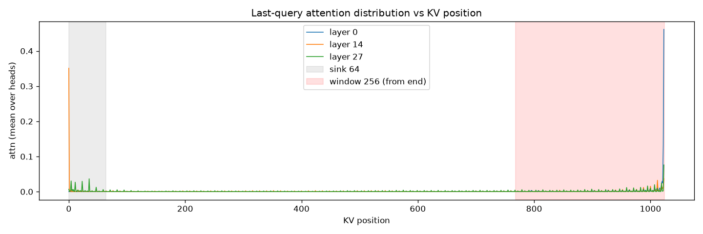
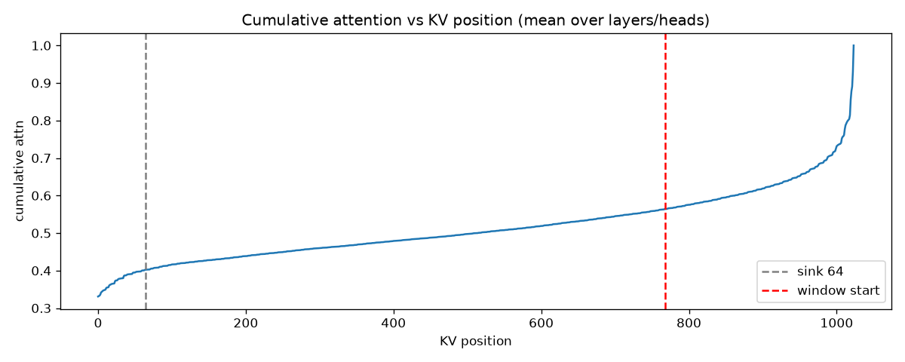
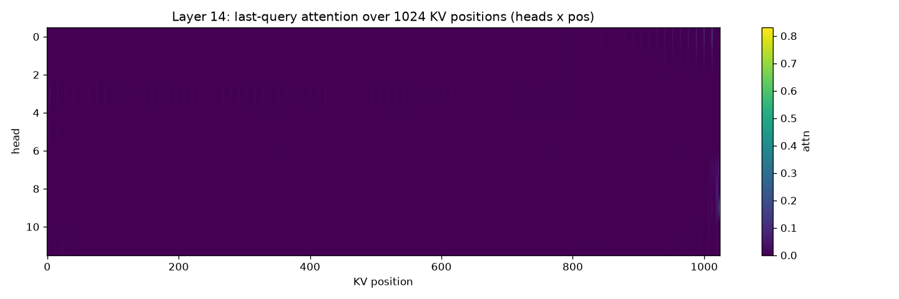

# 注意力分布热力图（KV cache 视角）

> 日期：2026-09-12 ｜ 模型：Qwen2.5-1.5B-Instruct ｜ 输入：1024 token（真实文本，中间埋入一条事实 "the secret vault code is K7XQ21"）
> 方法：HF transformers + `output_attentions=True`（eager），取**最后一个 query** 对各 KV 位置的注意力。

## 0. 量化统计（先看数）

| 统计口径 | sink 64 | 最近 256 | 中间段(64…768) | top 10% 位置 |
|---|---|---|---|---|
| 末层（layer 27），头平均 | 0.227 | **0.450** | 0.323 | **0.679** |
| 全 28 层平均，头平均 | **0.402** | **0.436** | 0.162 | **0.767** |

读法：注意力高度集中——**top 10% 的位置吃掉 68–77% 的注意力质量**；开头 sink 段（64 token）占 23%（末层）~40%（层均）；最近 256 占 ~45%。

## 1. 各 KV 位置的注意力分布（末层/中层/首层）



- 横轴 = KV 位置（0..1023）；纵轴 = 注意力权重（头平均）。
- 灰区 = 前 64（sink）；红区 = 末尾 256。
- 可见：**开头 sink 尖峰 + 末尾集中**，中段整体较低但有零散尖峰（可能对应语义显著 token）。

## 2. 累积注意力覆盖曲线



- 曲线越早接近 1，说明注意力越集中。
- 可用来判断"保留多少位置能覆盖多少注意力质量"——是 eviction 预算选择的直接依据。

## 3. 头维度热力图（单层内每个头的行为差异）





- 横轴 = KV 位置，纵轴 = 头（12 个）。
- 明显可见**头的分工**：部分头呈"局部/近端"模式，部分头在 sink 或特定位置有强尖峰——这正是 FastGen/DuoAttention 类"按头分配策略"的依据。

## 4. 与 KV 压缩的关系（本项目的解读）

| 观察 | 对压缩的含义 |
|---|---|
| top 10% 占 68–77% 质量 | 从"注意力质量"看，KV 确实高度冗余 → 裁剪/低秩有空间 |
| sink + 末尾窗口 ≈ 66–84% | 解释了 StreamingLLM/RSWA"保留开头 + 最近窗口"的合理性 |
| 中段仍有 16–32%（且含零散尖峰） | 解释了**为什么丢 prompt 中段会掉分**（我们 LongBench 实测：0.345→0.22/0.12） |
| 头间差异大 | 支持"按头定预算"（FastGen/DuoAttention）而非全局统一裁剪 |

**关键提醒**：注意力质量 ≠ 信息价值。埋入的事实（needle）只占很小质量，却是唯一答案来源 → 纯按质量裁剪会丢关键信息，这是 SnapKV 类方法要用"观察窗口 + 重要性"而非静态统计的原因。

## 5. 复现

```bash
# 服务器（系统 python，需 matplotlib）
/usr/local/bin/python3 bench/attn_heatmap.py
# 输出：/hy-tmp/plots/attn_positions.png / attn_cumulative.png / attn_heads_L*.png
```

脚本：`bench/attn_heatmap.py`（1024 token，Qwen2.5-1.5B，eager attention）。
